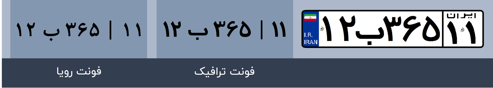
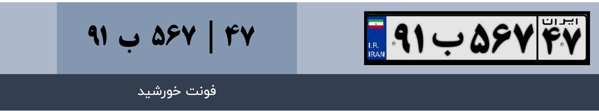
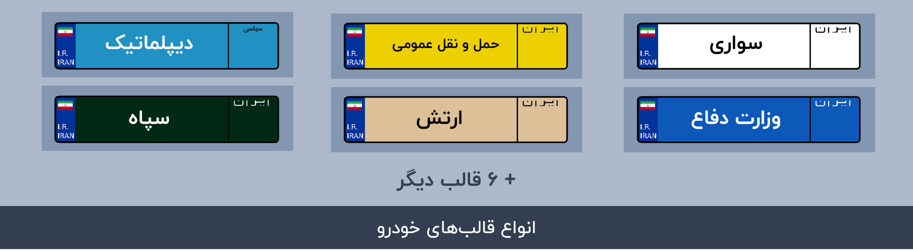

# Datasets used to train the model

what you can find here:

## Fonts

Fonts used to create license plate are `Traffic Bold`, `Khorshid`, and `Roya Bold`. these are the fonts that are used in real new edition of license plates.
you can find `.ttf` file of fonts in the `Fonts` directory.

## Glyphs

Glyphs (characters) used in plates including numbers and letters are extracted from the fonts to generate virtual license plates, renamed to represent their glyph and are processed to have no background or extra paddings, and resized to fit in the templates.

## Templates

Different plate templates are used to represent the functionality and origin of the vehicle. you can find the images of these templates with numbers and letters removed, and a `psd` file containing all of these images in the `Templates` directory.